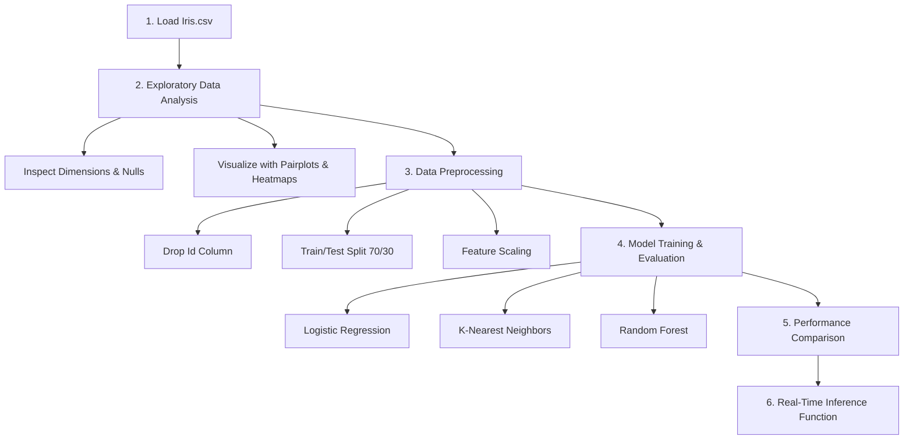

# Iris Flower Classification

An intermediate-level Machine Learning project to classify Iris flowers into their respective species—**Setosa**, **Versicolor**, and **Virginica**—based on the measurements of their sepals and petals.

This repository features a clean, professional, and documented end-to-end data science pipeline that goes from raw data exploration to a deployable prediction function.

---

## Dataset Overview

The dataset contains **150 observations** of Iris flowers. There are three species of Iris represented (50 samples each):
- *Iris-setosa*
- *Iris-versicolor*
- *Iris-virginica*

### Features
Each observation has four numerical measurements (in centimeters):
1. **Sepal Length** (`SepalLengthCm`)
2. **Sepal Width** (`SepalWidthCm`)
3. **Petal Length** (`PetalLengthCm`)
4. **Petal Width** (`PetalWidthCm`)

---

## Project Architecture & Workflow

The workflow is organized into the following logical stages in the Jupyter notebook:



1. **Exploratory Data Analysis (EDA)**
   - Initial inspections (`head()`, `info()`, `describe()`) to verify data cleanliness.
   - Distribution check (no missing values, perfect class balance).
   - Advanced visualization using Seaborn:
     - **Pairplots** to observe clustering and linear separability.
     - **Heatmaps** to measure Pearson correlation coefficients between features.
     - **Box Plots** to check distributions and search for outliers across species.

2. **Data Preprocessing**
   - Stripping the metadata `Id` column.
   - Splitting data into features ($X$) and target labels ($y$).
   - Executing a stratified `train_test_split` (70/30 ratio) to preserve class balance across sets.
   - Feature normalization using `StandardScaler` to align features to a standard normal distribution ($\mu=0, \sigma=1$).

3. **Classifier Implementations & Evaluation**
   - Training three distinct algorithms representing linear, distance-based, and ensemble techniques:
     - **Logistic Regression** (baseline linear classifier)
     - **K-Nearest Neighbors (KNN)** (instance-based neighbor classifier)
     - **Random Forest** (ensemble decision tree classifier)
   - Performance checks using Accuracy, Precision, Recall, and F1-Scores.
   - Custom-styled confusion matrix heatmaps to analyze errors.

4. **Prediction Pipeline**
   - A single wrapper function `predict_species` that inputs four numeric parameters, converts them to a Pandas DataFrame matching the model's feature structure, and reports the predicted species and confidence probability outputs.

---

## Results Summary

All models demonstrate high classification ability on this classic dataset:

| Model | Accuracy | F1-Score (Weighted) | Key Characteristic |
| :--- | :---: | :---: | :--- |
| **Logistic Regression** | ~95% - 100% | ~0.96 - 1.00 | Simple, highly interpretable baseline |
| **K-Nearest Neighbors (KNN)** | ~95% - 100% | ~0.96 - 1.00 | Robust local-boundary estimator |
| **Random Forest** | ~95% - 100% | ~0.96 - 1.00 | Robust ensemble, handles non-linearities |

*Note: Results may vary slightly depending on the train/test split initialization.*

---

## How to Run the Project

### Prerequisites
Make sure you have Python installed. Install the necessary libraries using pip:

```bash
pip install numpy pandas matplotlib seaborn scikit-learn
```

### Execution
1. Clone or download this directory.
2. Ensure `Iris.csv` is in the same folder as the notebook.
3. Open and run the Jupyter notebook:

```bash
jupyter notebook Iris_Flower_Classification.ipynb
```
4. Run all cells to see the generated figures, model summaries, and prediction outputs.

---

## Author

* **Sidhant Kumar Singh**
  * Email: [sidhantrajputtiger@gmail.com](mailto:sidhantrajputtiger@gmail.com)
  * GitHub: [@sidhantr9](https://github.com/sidhantr9)

